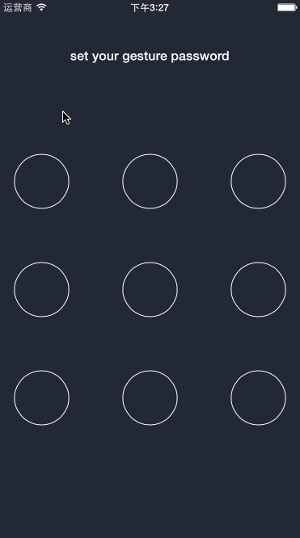

# YLSwipeLockView
a swipe password view to unlock an application written in objective-c.

## Requirements

YLSwipeLockView works on iOS 6.0 and later version and is compatible with ARC projects. It depends on the following Apple frameworks, which should already be included with most Xcode templates:

* Foundation.framework
* UIKit.framework
* CoreGraphics.framework
* QuartzCore.framework

## Usage

 1. Copy the YLSwipeLockView folder to your project.
 2. Add YLSwipeLockView as a subview wherever you want add set a delegate to this YLSwipeLockView.

```objective-c
		
YLSwipeLockView *lockView = [[YLSwipeLockView alloc] initWithFrame:CGRectMake(20, self.view.bounds.size.height - viewHeight - 40 - 100, viewWidth, viewHeight)];
[self.view addSubview:lockView];
self.lockView = lockView;
self.lockView.delegate = self;
    
-(YLSwipeLockViewState)swipeView:(YLSwipeLockView *)swipeView didEndSwipeWithPassword:(NSString *)password
{
    //everytime user finish a swipe, this method get called and pass a password, add your logic here.
    
}
```
## License

This code is distributed under the terms and conditions of the [MIT license](LICENSE).
